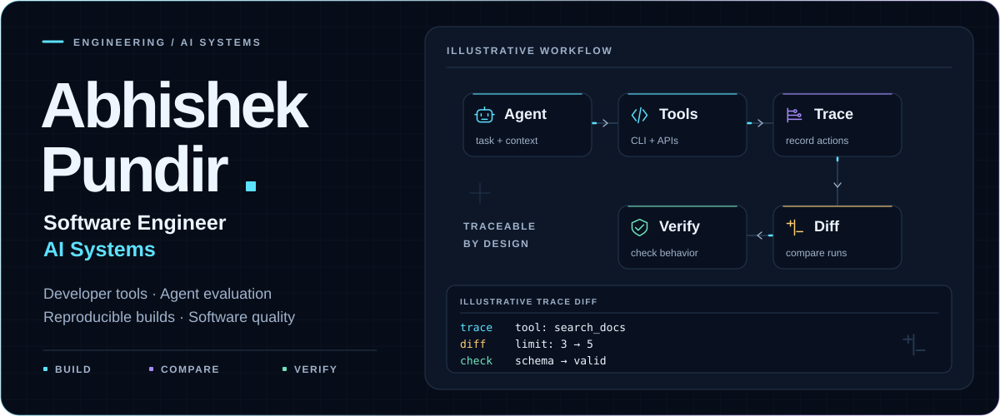
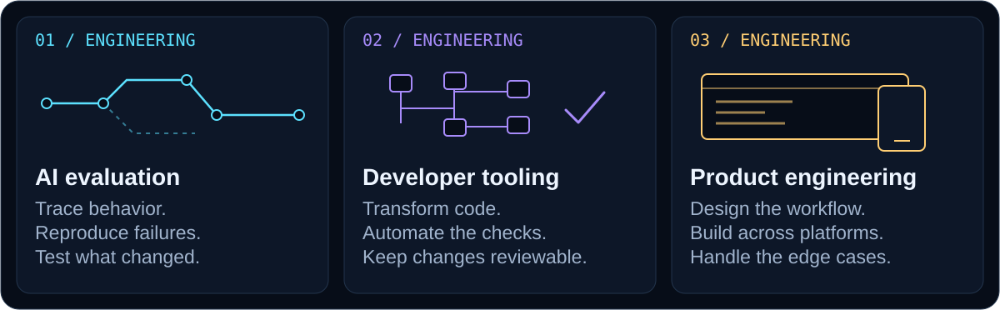
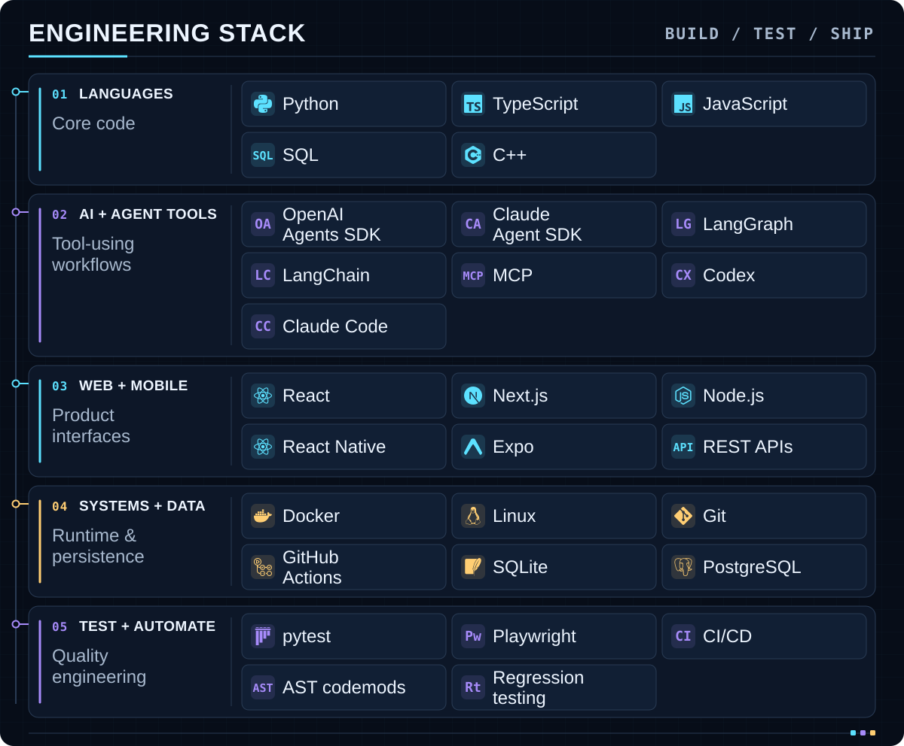

<picture>
  <source media="(max-width: 600px) and (prefers-reduced-motion: reduce)" srcset="assets/hero-mobile-static.svg" />
  <source media="(prefers-reduced-motion: reduce)" srcset="assets/hero-static.svg" />
  <source media="(max-width: 600px)" srcset="assets/hero-mobile.svg" />
  
</picture>

<p align="center">
  <b>AI software engineering · Coding-agent evaluation · Developer tooling</b>
</p>
<p align="center">
  <a href="#my-stack">Skills &amp; stack</a> &nbsp; / &nbsp;
  <a href="#how-i-engineer">Engineering approach</a> &nbsp; / &nbsp;
  <a href="#selected-work">Selected work</a> &nbsp; / &nbsp;
  <a href="https://www.linkedin.com/in/abhishek-pundir-920740317/">Connect ↗</a>
</p>

I’m **Abhishek Pundir**, a software engineer with a foundation in **mathematics, statistics, and computer science**. I work where AI-generated behavior meets real software: evaluating coding agents, investigating failures, building developer tools, and creating web and mobile products.

My work spans **code review, automated verification, agent integrations, reproducible environments, and full-stack development**. I care about the details that make a system dependable: observable behavior, clear interfaces, edge cases, and changes another engineer can understand.

In evaluation work, I design and review **coding benchmarks**, validate **tasks, tests, and verifiers**, analyse **agent trajectories**, and investigate **failure attribution**. This includes **adversarial QA** and reviewing model-generated patches.

## What I work on

<picture>
  <source media="(max-width: 600px)" srcset="assets/capabilities-mobile.svg" />
  
</picture>

## My stack

Tools I use across AI systems, software evaluation, infrastructure, and product development.

<picture>
  <source media="(max-width: 600px)" srcset="assets/stack-mobile.svg" />
  
</picture>

<details>
<summary><b>Explore the full stack and where I apply it</b></summary>

| Area | Technologies | What I use them for |
| --- | --- | --- |
| **Languages** | Python, TypeScript, JavaScript, SQL, C++ | Evaluation tools, automation, application logic, and data handling. |
| **AI & agent tooling** | OpenAI Agents SDK, Claude Agent SDK, LangGraph, LangChain, MCP, Codex, Claude Code | Agent integrations, tool-call analysis, evaluation workflows, and AI-assisted development. |
| **Web & mobile** | React, Next.js, Node.js, React Native, Expo, REST APIs | Full-stack products, conversational interfaces, and mobile workflows. |
| **Systems & data** | Docker, Linux, Git, GitHub Actions, SQLite, PostgreSQL | Reproducible environments, local-first storage, relational data, and delivery pipelines. |
| **Testing & automation** | pytest, Playwright, CI/CD, AST codemods, regression testing | Executable checks, end-to-end tests, structural code changes, and failure reproduction. |

</details>

## How I engineer

**01 / Make behavior visible**<br />
Inspect inputs, tool calls, arguments, and outputs. A final score rarely explains the whole failure.

**02 / Turn uncertainty into a reproducible case**<br />
Isolate the environment, reduce the problem, and identify the state transition or assumption that broke.

**03 / Build checks around the important behavior**<br />
Test boundaries and failure paths. Make regressions detectable through executable tests and CI.

**04 / Keep changes explainable**<br />
Prefer explicit interfaces, deterministic transformations where possible, and evidence that makes review easier.

<details>
<summary><b>Professional background &amp; foundations</b></summary>

My professional experience includes **software engineering, AI evaluation, quality assurance, and data-focused work**.

| Organisation | Experience |
| --- | --- |
| **Mercor** | Software engineering; previously AI Generalist Expert on a freelance basis. |
| **Handshake** | Freelance software engineering and terminal benchmarking. |
| **Mindrift** | Software engineering and QA: code review, defect reproduction, and robustness checks. |
| **AfterQuery Experts** | Software engineering expertise, testing, and benchmark validation. |

Additional AI and data experience includes **Outlier, Invisible Technologies, Deccan AI, and micro1**.

**Academic foundation:** M.Sc. Computer Science, Dr. Bhimrao Ambedkar University (2024–2026); B.Sc. Mathematics, Statistics and Computer Science, Central University of Rajasthan (2021–2024). **GATE Computer Science 2026: qualified.**

</details>

## Selected work

A few examples of these skills in practice.

### [tracediff ↗](https://github.com/Abhishekpundir23/tracediff)
**Agent behavior → structural comparison → regression evidence**<br />
A Python CLI and CI integration for comparing tool trajectories, argument drift, pass rates, cost, and repeated-run variance. Includes adapters for LangGraph, OpenAI Agents SDK, and Claude Agent SDK.

`Python` · `pytest` · `GitHub Actions` · `Agent SDKs`

### [API Migrator ↗](https://github.com/Abhishekpundir23/api-migrator)
**SDK change → AST transformation → verification preview**<br />
An operator-reviewed TypeScript SDK migration pilot. Deterministic codemods and isolated verification make proposed changes easier to inspect.

`TypeScript` · `Node.js` · `AST codemods` · `Docker` · `SQLite` · `GitHub App integration`

### [Formo ↗](https://github.com/Abhishekpundir23/formo)
**Form definition → branching conversation → response analytics**<br />
A self-hostable conversational form builder with conditional logic, analytics, and optional AI-assisted form generation.

`Next.js` · `React` · `TypeScript` · `SQLite` · `Playwright`

### [Pulse Fitness Manager ↗](https://github.com/Abhishekpundir23/pulse-fitness-manager)
**Gym workflows → local-first Android app**<br />
Memberships, payments, attendance, PDF invoices, and backup/restore with on-device storage. [Explore the Android release](https://github.com/Abhishekpundir23/pulse-fitness-manager/releases/latest).

`React Native` · `Expo` · `TypeScript` · `SQLite` · `EAS Build`

---

I’m especially interested in **AI developer infrastructure, coding-agent reliability, software evaluation, and practical products**. If you’re building in that space, [let’s connect](https://www.linkedin.com/in/abhishek-pundir-920740317/).

<details>
<summary><b>How this profile is built</b></summary>

The illustrations are generated from Python into self-contained SVGs. The layout changes for phones, artwork follows GitHub’s theme, and animation respects reduced-motion preferences. The workflow animation is an illustration of an engineering process.

The text, links, and expandable sections are native GitHub Markdown. Explore the [generators](scripts/) and [design notes](DESIGN.md), or regenerate the artwork with:

```sh
python3 scripts/build_profile.py
```

</details>
