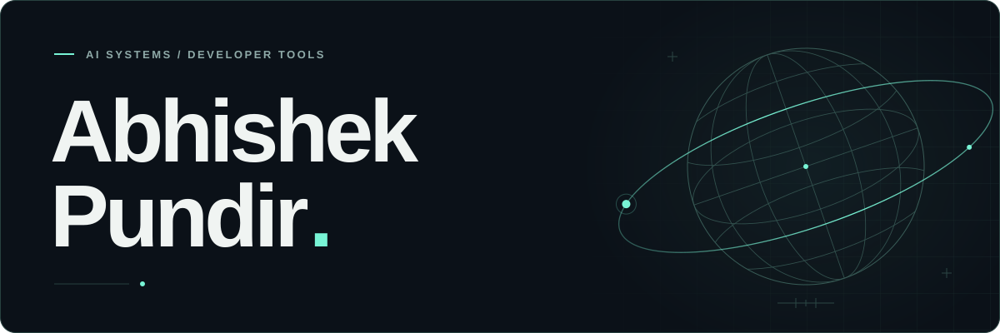

<picture>
  <source media="(prefers-color-scheme: light)" srcset="assets/hero-light.svg" />
  
</picture>

  <h3>Building useful software. Making AI behavior understandable.</h3>
  
I’m Abhishek, a software engineer working on <b>AI agent evaluation</b>, 
  <b>developer infrastructure</b>, and products people can use.

  

    <a href="#selected-work">Explore my work</a> &nbsp; / &nbsp;
    <a href="https://www.linkedin.com/in/abhishek-pundir-920740317/">LinkedIn</a> &nbsp; / &nbsp;
    <a href="https://github.com/Abhishekpundir23?tab=repositories">All repositories</a>
  

 

## Selected work

<table>
  <tr>
    <td width="50%" valign="top">
      01 &nbsp; / &nbsp; AI EVALUATION
      <h3><a href="https://github.com/Abhishekpundir23/tracediff">tracediff ↗</a></h3>
      
Regression testing for AI agents: tool trajectories, argument drift, cost, and repeated-run variance.

      
<code>Python</code> <code>CLI</code> <code>GitHub Actions</code>

      Make changes in agent behavior visible.
    </td>
    <td width="50%" valign="top">
      02 &nbsp; / &nbsp; DEVELOPER TOOLS
      <h3><a href="https://github.com/Abhishekpundir23/api-migrator">API Migrator ↗</a></h3>
      
A TypeScript SDK migration pilot with deterministic AST transforms and operator-reviewed verification previews.

      
<code>TypeScript</code> <code>AST</code> <code>Docker</code>

      Understand the change before it ships.
    </td>
  </tr>
  <tr>
    <td width="50%" valign="top">
      03 &nbsp; / &nbsp; WEB PRODUCTS
      <h3><a href="https://github.com/Abhishekpundir23/formo">Formo ↗</a></h3>
      
Self-hosted conversational forms with branching logic, response analytics, and optional AI-assisted generation.

      
<code>Next.js</code> <code>React</code> <code>SQLite</code>

      Turn a form into a conversation.
    </td>
    <td width="50%" valign="top">
      04 &nbsp; / &nbsp; MOBILE PRODUCTS
      <h3><a href="https://github.com/Abhishekpundir23/pulse-fitness-manager">Pulse Fitness Manager ↗</a></h3>
      
An Android app for memberships, payments, and attendance. On-device storage, PDF invoices, and backup/restore.

      
<code>React Native</code> <code>Expo</code> <code>SQLite</code>

      <a href="https://github.com/Abhishekpundir23/pulse-fitness-manager/releases/latest">Explore the Android release ↗</a>
    </td>
  </tr>
</table>

 

## What I bring to the build

**AI & evaluation** &nbsp; Agent integrations, tool-call tracing, regression analysis, and reproducible experiments.

**Engineering** &nbsp; Python, TypeScript, SQL, Docker, GitHub Actions, and automated testing.

**Products** &nbsp; React, Next.js, Node.js, React Native, Expo, and SQLite.

 

> Make behavior observable. Make failures reproducible. Make changes reviewable.

I’m interested in better tools for the people building with AI. If that’s your kind of problem too, [let’s connect](https://www.linkedin.com/in/abhishek-pundir-920740317/).

<picture>
  <source media="(prefers-color-scheme: light)" srcset="assets/footer-light.svg" />
  
</picture>
